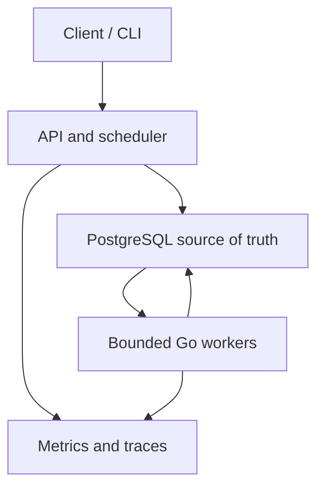
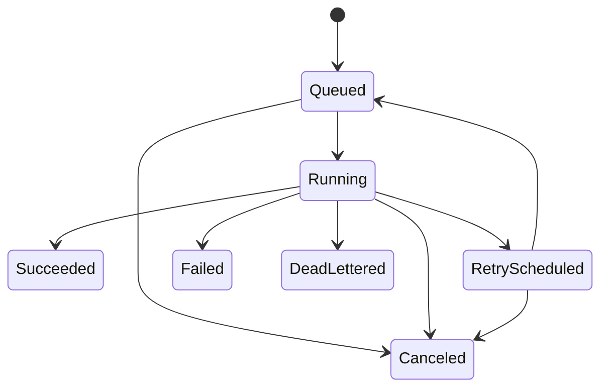

# TaskForge

TaskForge is a production-like distributed job and workflow orchestration
platform written in Go. It is designed to demonstrate durable background
processing, idempotent execution, retries, concurrency control, failure
recovery, and operational visibility through incremental milestones.

> TaskForge is an educational portfolio project. It does not yet claim
> production readiness or exactly-once execution.

## Why TaskForge?

Starting work in a goroutine is easy; guaranteeing that the work survives a
process crash, is not executed concurrently by multiple workers, and can be
safely retried is much harder. TaskForge makes those failure cases part of the
design rather than hidden implementation details.

## Architecture direction



NATS JetStream will be introduced later for notification and distribution,
after the PostgreSQL durability and recovery model is proven. PostgreSQL will
remain authoritative, with a transactional outbox preventing unsafe dual
writes.

## Engineering focus

- Explicit job state machine
- PostgreSQL transactions and row-level locking
- Transactional job claiming, followed by leases and recovery in v0.2
- At-least-once delivery with idempotent handlers
- Sequential execution in v0.1, followed by bounded worker pools in v0.2
- Exponential backoff, jitter, and dead-letter handling
- gRPC, NATS JetStream, Prometheus, and OpenTelemetry in later milestones
- Race testing, integration testing, benchmarks, load tests, and chaos scenarios

## Current status

The repository is at the **v0.1 foundation** stage. The initial scaffold
contains:

- A minimal HTTP process with `/healthz`
- Environment configuration with bounded timeouts
- An explicit job state transition model
- Initial PostgreSQL jobs and attempts schema
- Docker Compose development environment
- Non-root container image
- CI with formatting, vet, tests, race tests, and builds
- PRD, project memory, security policy, and the first ADR

The migration runner, API, PostgreSQL repository, sequential worker, and
database-aware readiness endpoint are intentionally not yet implemented; they
are the v0.1 delivery scope. The current Compose setup starts PostgreSQL and the
HTTP scaffold, but it does not execute migrations or initialize the jobs table.

## Quick start

Requirements:

- Go 1.25.x
- Docker with Compose
- Git

Start the local stack:

```powershell
Copy-Item .env.example .env
docker compose up --build
Invoke-RestMethod http://127.0.0.1:8080/healthz
```

Expected response:

```json
{"status":"ok"}
```

This currently verifies process liveness only. `/readyz`, PostgreSQL migration
execution, and database readiness will be implemented during v0.1.

Run local validation on PowerShell without requiring `make`:

```powershell
go mod tidy
gofmt -w .
go vet ./...
go test ./...
go test -race ./...
go build ./...
docker compose config --quiet
```

On a Unix-like development environment with `make`, the equivalent validation
after formatting is:

```bash
make check
```

If GitHub CLI is unavailable, create the empty public `Nuryanfa/TaskForge`
repository through the GitHub website, then connect and push it with Git:

```powershell
git remote add origin https://github.com/Nuryanfa/TaskForge.git
git branch -M main
git push -u origin main
```

## Job lifecycle



Terminal jobs cannot transition back to an active state. Later releases will
add stricter transactional guards and execution fencing around these domain
rules.

## Milestone boundaries

v0.1 delivers PostgreSQL migration execution and a PostgreSQL repository; the
submit, get, and cancel HTTP API; sequential single-worker execution; a
transactional queued-to-running claim; persisted attempts and outcomes;
database-aware readiness; graceful shutdown; and integration tests against a
real PostgreSQL instance.

v0.1 deliberately excludes multiple concurrent worker goroutines, job leases,
lease heartbeat and renewal, fencing tokens, expired-lease recovery, worker
crash recovery, NATS, scheduled jobs, and workflow DAGs. If the single worker
process dies while a job is running, that job is not automatically recovered.
Leases, fencing, heartbeat, bounded concurrent workers, and crash recovery are
introduced in v0.2 through new code and a new database migration.

## Roadmap

| Version | Scope | Status |
| --- | --- | --- |
| v0.1 | PostgreSQL repository, HTTP API, and sequential worker | In progress |
| v0.2 | Concurrent workers, leases, fencing, heartbeat, and crash recovery | Planned |
| v0.3 | Retries, idempotency, and dead-letter queue | Planned |
| v0.4 | Delayed and recurring scheduling | Planned |
| v0.5 | Transactional outbox and NATS JetStream | Planned |
| v0.6 | Workflow DAGs and saga compensation | Planned |
| v0.7 | Metrics, tracing, dashboards, and SLOs | Planned |
| v0.8 | High availability, Kubernetes, load, and chaos testing | Planned |

See the [product requirements](docs/PRD.md),
[project memory](docs/PROJECT_MEMORY.md), and
[architecture decisions](docs/adr/0001-postgresql-source-of-truth.md).

## Security

Job payloads and failure details may contain sensitive data. TaskForge will not
log payloads or expose raw internal errors. Local Compose credentials are for
development only. See [SECURITY.md](SECURITY.md).

## License

No license has been selected yet. Until one is added, all rights are reserved.
